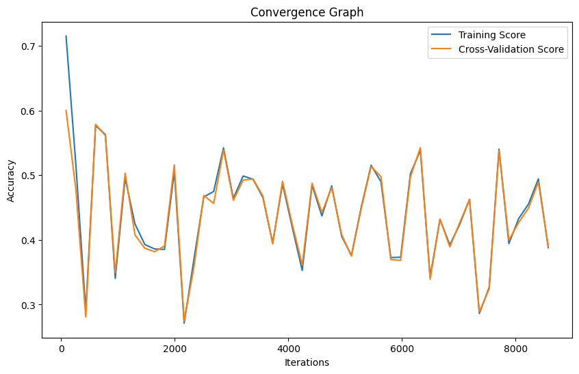

# Parameter-Optimization-of-SVM

This project is an implementation of Support Vector Machine (SVM) algorithm using parameter optimization with randomization in R programming language.

## About SVM

SVM is a widely used machine learning algorithm that can effectively perform classification and regression analysis, however primarily used for classification problem. Its approach involves identifying the most optimal hyperplane to separate data into distinct classes. Parameter optimization is a crucial aspect of SVM, as it can significantly enhance the model's accuracy by refining its performance.

## About Parameter Optimization

The process of parameter optimization involves carefully choosing the most suitable configuration of parameters for a particular algorithm to attain the highest level of performance possible. By selecting the optimal set of parameters, the algorithm can be fine-tuned to improve its accuracy and efficiency in solving a specific problem or task.
In order to enhance the accuracy of SVM, certain crucial parameters like kernel, C, and gamma need to be adjusted appropriately, which is known as Hyperparameter Tuning. One way to accomplish this is by utilizing GridSearchCV, a popular tool for parameter optimization.
In this particular project, a Fitness Function has been employed to optimize the parameters. 

## Parameters Optimized

The following parameters are optimized in this project:

- **nu(C):** the parameter that controls the number of support vectors used in the model.
- **kernel:** the kernel function used for the SVM algorithm.
- **epsilon(gamma):** the margin of error allowed in the SVM algorithm.

## Dataset
The dataset for the project has been downloaded from the UCI Machine Learning Repository.
[https://archive.ics.uci.edu/ml/datasets/Dry+Bean+Dataset](https://archive.ics.uci.edu/ml/datasets/Dry+Bean+Dataset)

Number of Instances: 13611

Number of Attributes: 17

## Result

## Conclusion
From the above graph, we can conclude that the model is well trained and parameter have been optimized due to the less gap between training and cross-validation curve.
The graph is made for the sample which has best accuracy. Sample 2 has the best accuracy of 0.68 having kernel = linear, Nu = 4.73 and Epsilon = 8.91.
